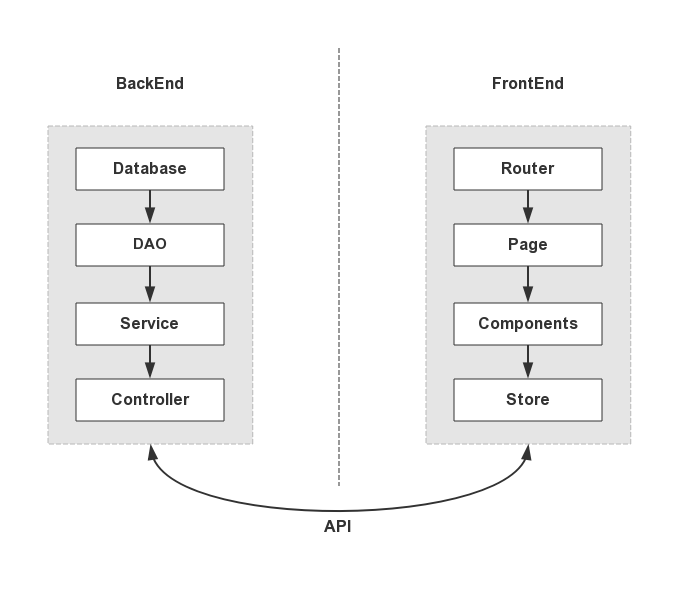

# GraphQL 初探

<pre class="prism">{
  hero {
    name     height     mass
  }
}</pre>

<pre class="prism language-json">{
  "hero": {
    "name": "Luke Skywalker"
  }
}</pre>

<pre class="prism language-json">{
  "hero": {
    "name": "Luke Skywalker",
    "height": 1.72
  }
}</pre>

<pre class="prism language-json">{
  "hero": {
    "name": "Luke Skywalker",
    "height": 1.72,
    "mass": 77
  }
}</pre>

Note: reveal-md demo.md  --scripts demo.js,https://www.google-analytics.com/analytics.js  --css demo.css

<!--s-->

## 摘要

1. 概念
2. 语法
3. 使用
4. Util - DAO - Resolver

<!--v-->

### 声明

1. 不关注特别细节的问题
2. 主要面向前端组人员扩展视野
3. 服务端端轻喷

<!--s-->

## 概念

### 前后端结构

<!--v-->

<!--v-->

<!--s-->

THX ~
